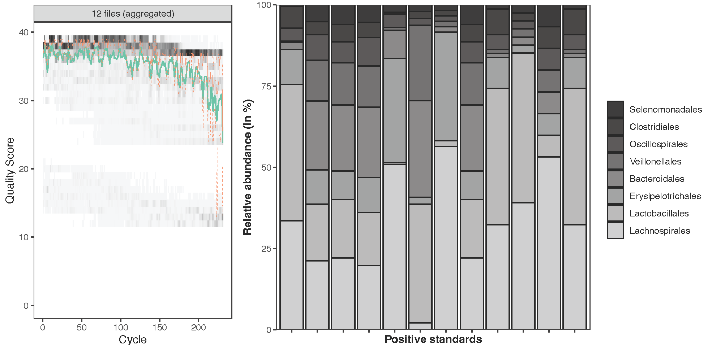

## Absence of a pancreatic microbiome in Intraductal Papillary Mucinous Neoplasm (IPMN)

Marie-Madlen Pust<sup>1,2,3</sup>, Darío Missael Rocha Castellanos<sup>4</sup>,
Kara Rzasa<sup>1*</sup>, Andrea Dame<sup>1</sup>, Gleb Pishchany<sup>1,5</sup>,
Charnwit Assawasirisin<sup>4</sup>, Andrew Liss<sup>4</sup>,
Carlos Fernández-del Castillo<sup>4#</sup>,
Ramnik Xavier<sup>1,2,3#</sup>

<sup>1</sup>Broad Institute of MIT and Harvard, Cambridge, USA. <br>
<sup>2</sup>Center for Computational and Integrative Biology, Massachusetts General Hospital, Boston, USA.<br>
<sup>3</sup>Department of Medicine, Harvard Medical School, Boston, USA.<br>
<sup>4</sup>Department of Surgery, Massachusetts General Hospital & Harvard Medical School, Boston, USA.<br>
<sup>5</sup>Department of Biological Chemistry and Molecular Pharmacology, Harvard Medical School, Boston, USA.<br>
<sup>*</sup>Currently at Department of Microbiology and Immunology, Geisel School of Medicine at Dartmouth, Dartmouth College, Hanover, USA<br>


#### Documentation
```
#######################################
# Notes:
#######################################
# Customised R functions have been provided in R/base_functions.R
# and are sourced automatically when running pipeline steps

#######################################
## Data cleaning (from command-line) ##
#######################################
# modify the following info, if required:
# your working directory, input directory, 
# the output directory,
# reference database of choice and
# filtering parameters

# run script:
nohup Rscript step01.R

# Three output files are generated (end of script):
  write.table(
    seqtab.nochim4, 
    file=paste0(outPath,"/", 
                out_pref, 
                "_count_table_decontam.csv", sep=""), 
    sep=",", row.names = TRUE, col.names = NA)
  
  # count table
  write.table(
    seqtab.nochim3_cont, 
    file=paste0(outPath,"/", 
                out_pref, 
                "_count_table_contam.csv", sep=""), 
    sep=",", row.names = TRUE, col.names = NA)
  
  # filter statistics
  write.table(
    track2, 
    file=paste(outPath,"/", 
               out_pref, 
               "_filt_stats.csv", sep=""), 
    sep=",", row.names = TRUE, col.names = NA)

#######################################
## Data analysis (from command-line) ##
#######################################
# specify input files to count tables and statistics
# run script:
nohup Rscript step02.R
```


#### Metadata key
```
# Create the dictionary
clinical_data <- list(
  
  Patient_Clinical_Characteristics = list(
    Sex = c(Male=1, Female=2),
    Jaundice = c(Yes=1, No=0),
    Pancreatitis = c(Yes=1, No=2),
    Endoscopic_Ultrasound = c(Yes=1, No=0),
    Fine_Needle_Aspiration = c(Yes=2, No=1)
  ),
  
  Cyst_Characteristics = list(
    Mural_Node = c(Yes=1, No=0),
    Tumor_Location = c(Body=0, Head=1,
                       Tail=2, Uncinate_Process=3,
                       Neck=4),
    Cyst_Type = c(BD_IPMN=1, MD_IPMN=2, Mixed_IPMN=3,
                  Neuroendocrine_Tumor=4, MCN=5,
                  Serous_Cystadenoma=6, Pseudocyst=7,
                  Adenocarcinoma_CystComponent=8, Other_Cyst=9),
    Grade_Consensus = c(Low_Grade=1, High_Grade=2),
    Epithelial = c(Intestinal=1, Gastric=2,
                   Pancreatobiliary=3,
                   Oncocytic=4, Mixed=5),
    IPMN_Invasive_Component = c(Yes=2, No=1)
  )
  
)

# Access elements in the dictionary
clinical_data$Patient_Clinical_Characteristics$Sex
clinical_data$Cyst_Characteristics$Tumor_Location
```

#### Quality control of the runs with positive controls <br>


#### Information about the R session <br>
```
R version 4.2.1 (2022-06-23)
Platform: x86_64-pc-linux-gnu (64-bit)
Running under: Ubuntu 20.04.5 LTS

Matrix products: default
BLAS:   /usr/lib/x86_64-linux-gnu/blas/libblas.so.3.9.0
LAPACK: /usr/lib/x86_64-linux-gnu/lapack/liblapack.so.3.9.0

locale:
 [1] LC_CTYPE=C.UTF-8       LC_NUMERIC=C           LC_TIME=C.UTF-8        LC_COLLATE=C.UTF-8     LC_MONETARY=C.UTF-8    LC_MESSAGES=C.UTF-8    LC_PAPER=C.UTF-8      
 [8] LC_NAME=C              LC_ADDRESS=C           LC_TELEPHONE=C         LC_MEASUREMENT=C.UTF-8 LC_IDENTIFICATION=C   

attached base packages:
[1] parallel  stats4    stats     graphics  grDevices utils     datasets  methods  
[9] base     

other attached packages:
 [1] lmerTest_3.1-3      lme4_1.1-35.1       Matrix_1.6-3        RColorBrewer_1.1-3 
 [5] ggtree_3.10.0       DECIPHER_2.30.0     RSQLite_2.3.3       Biostrings_2.70.1  
 [9] GenomeInfoDb_1.38.1 XVector_0.42.0      IRanges_2.36.0      S4Vectors_0.40.1   
[13] BiocGenerics_0.48.1 dplyr_1.1.3         decontam_1.22.0     readr_2.1.4        
[17] ggplot2_3.4.4       dada2_1.30.0        Rcpp_1.0.11        

loaded via a namespace (and not attached):
  [1] splines_4.3.2               bitops_1.0-7                ggplotify_0.1.2            
  [4] tibble_3.2.1                cellranger_1.1.0            polyclip_1.10-6            
  [7] lifecycle_1.0.4             Rdpack_2.6                  rstatix_0.7.2              
 [10] lattice_0.22-5              vroom_1.6.4                 MASS_7.3-60                
 [13] backports_1.4.1             magrittr_2.0.3              gld_2.6.6                  
 [16] minqa_1.2.6                 cowplot_1.1.1               bayesm_3.1-6               
 [19] DBI_1.1.3                   multcomp_1.4-25             abind_1.4-5                
 [22] ShortRead_1.60.0            zlibbioc_1.48.0             expm_0.999-7               
 [25] GenomicRanges_1.54.1        purrr_1.0.2                 Kendall_2.2.1              
 [28] RCurl_1.98-1.13             yulab.utils_0.1.0           TH.data_1.1-2              
 [31] tensorA_0.36.2              tweenr_2.0.2                sandwich_3.0-2             
 [34] GenomeInfoDbData_1.2.11     tidytree_0.4.5              nortest_1.0-4              
 [37] pheatmap_1.0.12             vegan_2.6-4                 permute_0.9-7              
 [40] codetools_0.2-19            coin_1.4-3                  DelayedArray_0.28.0        
 [43] ggforce_0.4.1               tidyselect_1.2.0            aplot_0.2.2                
 [46] farver_2.1.1                matrixStats_1.1.0           GenomicAlignments_1.38.0   
 [49] jsonlite_1.8.7              e1071_1.7-13                survival_3.5-7             
 [52] tools_4.3.2                 treeio_1.26.0               lawstat_3.6                
 [55] DescTools_0.99.50           glue_1.6.2                  SparseArray_1.2.2          
 [58] mgcv_1.9-0                  MatrixGenerics_1.14.0       numDeriv_2016.8-1.1        
 [61] withr_2.5.2                 BiocManager_1.30.22         fastmap_1.1.1              
 [64] latticeExtra_0.6-30         boot_1.3-28.1               fansi_1.0.5                
 [67] digest_0.6.33               R6_2.5.1                    gridGraphics_0.5-1         
 [70] colorspace_2.1-0            jpeg_0.1-10                 utf8_1.2.4                 
 [73] tidyr_1.3.0                 generics_0.1.3              data.table_1.14.8          
 [76] robustbase_0.99-0           class_7.3-22                httr_1.4.7                 
 [79] S4Arrays_1.2.0              pkgconfig_2.0.3             gtable_0.3.4               
 [82] Exact_3.2                   modeltools_0.2-23           blob_1.2.4                 
 [85] lmtest_0.9-40               hwriter_1.3.2.1             carData_3.0-5              
 [88] multcompView_0.1-9          scales_1.2.1                Biobase_2.62.0             
 [91] lmom_3.0                    png_0.1-8                   ggfun_0.1.3                
 [94] rstudioapi_0.15.0           tzdb_0.4.0                  reshape2_1.4.4             
 [97] nloptr_2.0.3                nlme_3.1-163                proxy_0.4-27               
[100] cachem_1.0.8                zoo_1.8-12                  stringr_1.5.1              
[103] rootSolve_1.8.2.4           libcoin_1.0-10              pillar_1.9.0               
[106] grid_4.3.2                  reshape_0.8.9               vctrs_0.6.4                
[109] ggpubr_0.6.0                car_3.1-2                   cluster_2.1.4              
[112] mvtnorm_1.2-3               cli_3.6.1                   compiler_4.3.2             
[115] Rsamtools_2.18.0            rlang_1.1.2                 crayon_1.5.2               
[118] ggsignif_0.6.4              labeling_0.4.3              interp_1.1-4               
[121] plyr_1.8.9                  fs_1.6.3                    stringi_1.8.1              
[124] deldir_1.0-9                BiocParallel_1.36.0         munsell_0.5.0              
[127] lazyeval_0.2.2              rcompanion_2.4.34           compositions_2.0-6         
[130] hms_1.1.3                   patchwork_1.1.3             bit64_4.0.5                
[133] SummarizedExperiment_1.32.0 rbibutils_2.2.16            broom_1.0.5                
[136] memoise_2.0.1               RcppParallel_5.1.7          DEoptimR_1.1-3             
[139] bit_4.0.5                   readxl_1.4.3                ape_5.7-1

```
